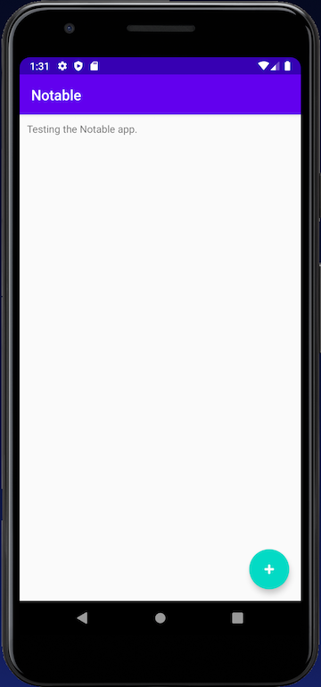
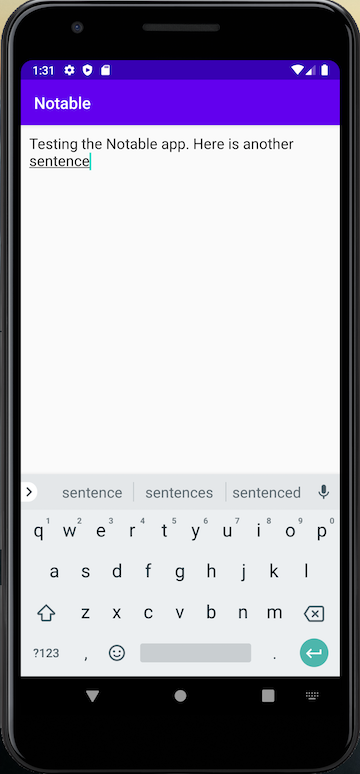
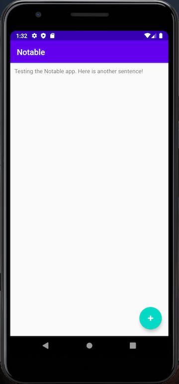
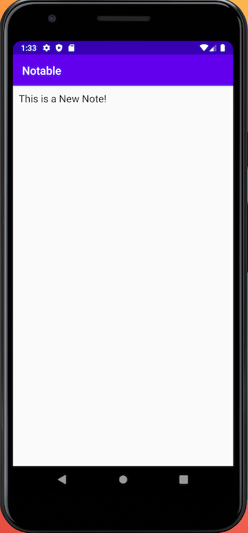

# Android-Notable
One of the many web development projects offered by HarvardX's CS50: Introduction to Computer Science course.

This mobile app development project uses Java and Android Studio to create a simple note taking app titled "Notable". The examples shown below display the applications's ability to create new content, save the content to the database, view existing notes, and edit existing notes. This was a simple introduction to android development using synergy between Android Studio and SQLite. 

This was my third Android application and my third attempt at coding with Java. I still require practice with the language, but the concept and steps to creating Android applications via Android Studio is becoming a repeatable process for me. I am eager to see what other Android applications I can develop.

Skills used: Java, Android Studio, Mobile app design (UX/UI Design), SQLite.
Gian Millare's Repository for CS50: Introduction to Computer Science by HarvardX ---> Visit Repository

---------------------------------------------------------------------------------------------------------------------------

 

---------------------------------------------------------------------------------------------------------------------------

 

---------------------------------------------------------------------------------------------------------------------------

 

---------------------------------------------------------------------------------------------------------------------------

 

